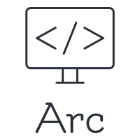

<center></center>


# Introduction

Arc is a python ASGI web framework designed for creating fast and dynamic web applications. Its still heavily under development, so if you encounter a problem, feel free to open an issue, all help is appreciated. Arc is built using Starlette and it runs on the lighting fast uvicorn web server.

# Installation
Arc is fairly straightforward with its installation process, and can be installed using `pip`.

```
# Windows
pip install arcframework

# Linux
pip3 install arcframework
```

# Quickstart
Arc is very straightforward to use, and is similar to frameworks such as Flask and Bottle.

**main.py**:

```py
from arc import App, TextResponse

app = App()

@app.route("/")
def home(request):
    return TextResponse("Hello, World")

if __name__ == "__main__": 
    app.run()
```

# Performance
Arc has decent performance, due to it being built with the stability of starlette, and running on uvicorn, and is async ready. For more performance, and for use in production environments, you can use gunicorn with UvicornWorker to squeeze the extra bit of performance out of Arc.